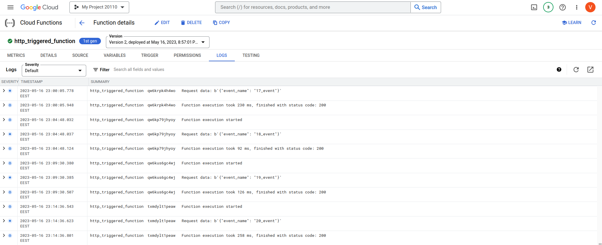
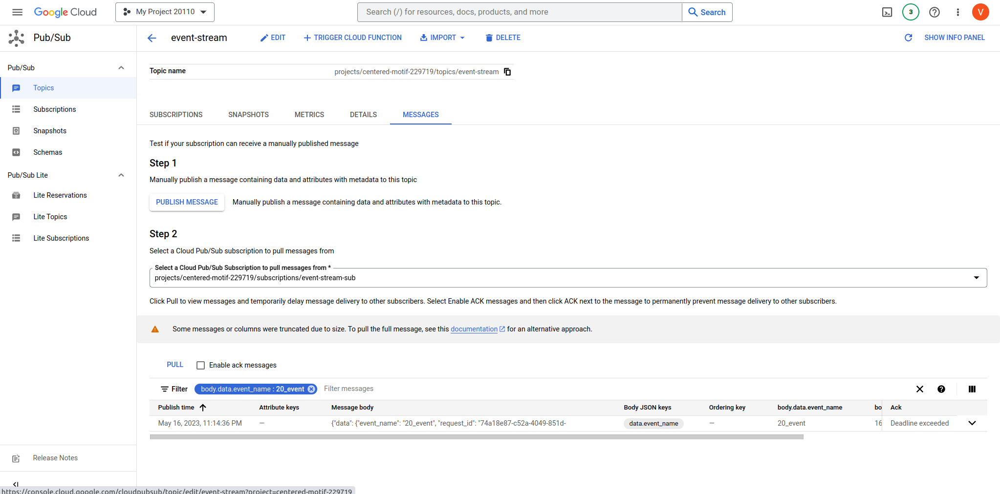
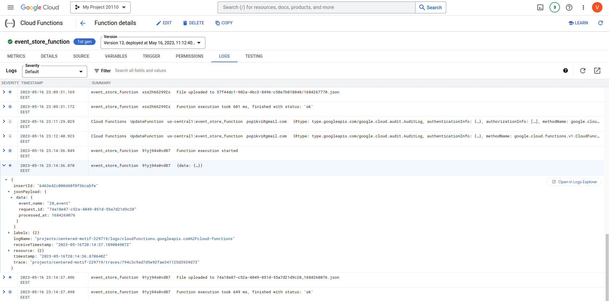
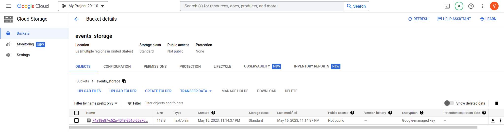
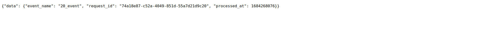

# 2. Function as a Service project

Project schema:


1. Implementation of HTTP-triggered Function, which ingests event to Event Stream, is here [http_triggered_function](https://github.com/Vadymor/cloud_computing/blob/6f9705db4e442379fe97f6bd5c5f67078421d84f/Task2/http_triggered_function).
    
    This function allows only authorized access, the http request should contain a token.
    
    This function randomly generates an identifier.
   
    Event has the next structure:
    ````
    {
        "data": {
            "event_name": event_name,
            "request_id": request_id,
            "processed_at": timestamp
        }
    }
    ````

    Finally, this function sends event to Pub/Sub topic.
   
    Below is an example:
   
    

---
2. Events are consumed by Pub/Sub topic - event-stream.

   Below is an example of the last arrived event:
   
   

---
3. Implementation of Function automatically triggered on new event in Event Stream, 
   and stores event content in a cloud Object Storage as json file, is here [event_store_function](https://github.com/Vadymor/cloud_computing/blob/6f9705db4e442379fe97f6bd5c5f67078421d84f/Task2/event_store_function).

   This function is triggered by Pub/Sub.

   This function processes an incoming event and stores it in a .json file on Cloud Storage. 
   
   The name of the file is created based on events` 'request_id' and 'processed_at' timestamp (this should guarantee uniqueness).   

   Below is an example:
   
   

---
4. Created file in Cloud Storage

   
   And it content
   

---
For testing purpose was created a script that sends POST requests to the function with the 'event_name' value [http_request.py](https://github.com/Vadymor/cloud_computing/blob/6f9705db4e442379fe97f6bd5c5f67078421d84f/Task2/http_request.py).
