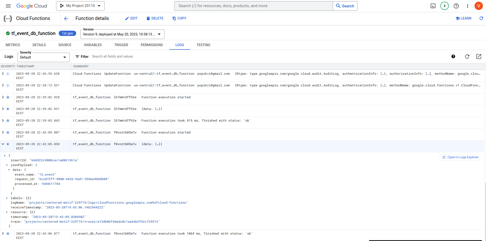
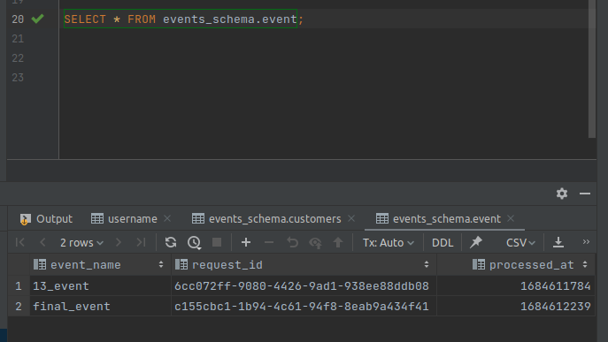

# 4. Add database to the FaaS project

This project is extended by adding storing events to the Cloud SQL database (MySQL).
Also, was used environment variables in Terraform for Cloud Functions and archive_file in Terraform to wrap function code into a zip archive.

1. Function code is [here](https://github.com/Vadymor/cloud_computing/blob/501d11a7ec692e462d0dd8b38320148416555d05/Task4/event_db_function/main.py).
2. Terraform configuration of database and function is [here](https://github.com/Vadymor/cloud_computing/blob/ffd40cda987e1e1abc1f453bea17f6e873579f07/Task4/db_resources.tf).

Screenshot of function invocation:

Screenshot of stored events in the database:

