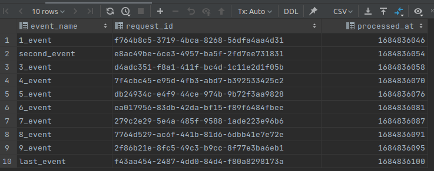

# 5. Database backup/restore

## Results

1. Data stored in the database after invoking a cloud function 10 times:

2. Data stored in the database after updating several records:

3. Data stored in the database after restoring:

## Process of backup and restore

### Create a backup

We are going to create an on-demand backup.

1. In the Google Cloud console, go to the Cloud SQL Instances page.
2. To open the Overview page of an instance, click the instance name.
3. From the SQL navigation menu, select Backups.

4. Click `CREATE BACKUP`.
5. In a menu print description.
6. Click `Create`.

### Restore an instance

We are going to restore the database instance from previously created backup.

1. In the Google Cloud console, go to the Cloud SQL Instances page.
2. To open the Overview page of an instance, click the instance name.
3. From the SQL navigation menu, select Backups.
4. Find the backup you want to use and select Restore.
5. In the Restore an instance from a backup dialog box, check that the name of the instance you want to use for the restore is selected in the instance drop-down menu. 
The default target instance is the same instance from which the backup was created.

6. Type the instance name in the Instance name field to confirm your selection
7. Click Restore to start the restore process.
8. Wait several minutes.