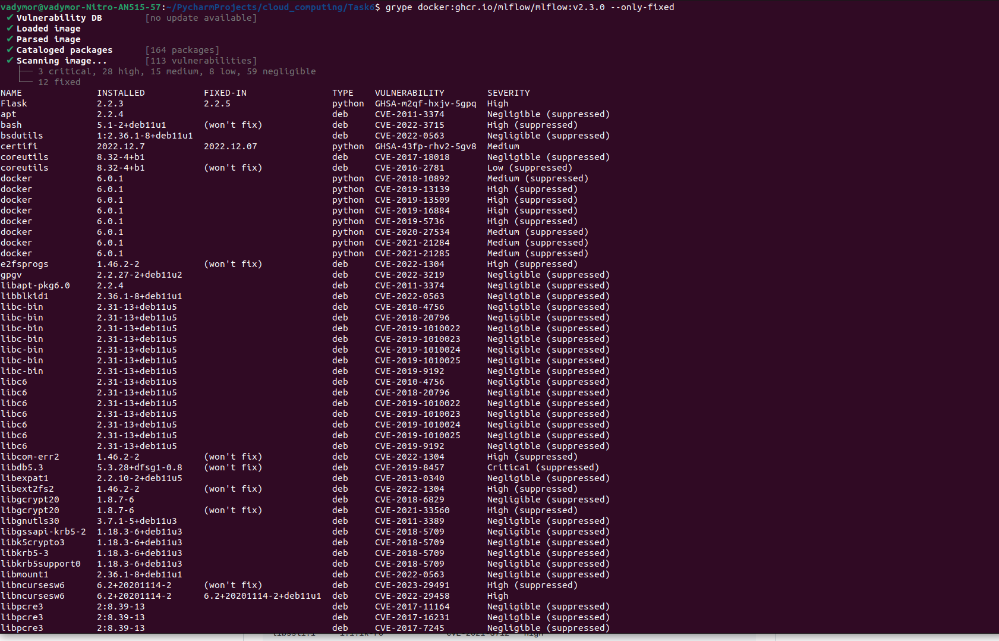

# 6. Haunting CVEs

0. Pull docker image of `ghcr.io/mlflow/mlflow:v2.3.0`.
````
docker pull ghcr.io/mlflow/mlflow:v2.3.0
````

## grype
1. Install grype with command: 
````
sudo curl -sSfL https://raw.githubusercontent.com/anchore/grype/main/install.sh | sudo sh -s -- -b /usr/local/bin
````
2. Scan with grype command:
````
grype docker:ghcr.io/mlflow/mlflow:v2.3.0 --only-fixed
````
However, it doesn't filter output: 


So, I created python [script](https://github.com/Vadymor/cloud_computing/blob/e48e4daa7c897883a13941d4b83c5975aa72abd0/Task6/grype_filter_output.py) 
that parse command output and show filtered scan results:


## trivy

1. Pull docker image of `trivy`.
````
docker pull aquasec/trivy:0.41.0
````
2. Scan with command:
````
docker run --rm -v ~/.trivy:/root/.cache/ aquasec/trivy:0.41.0 image --severity HIGH,CRITICAL --ignore-unfixed ghcr.io/mlflow/mlflow:v2.3.0
````
Results:


