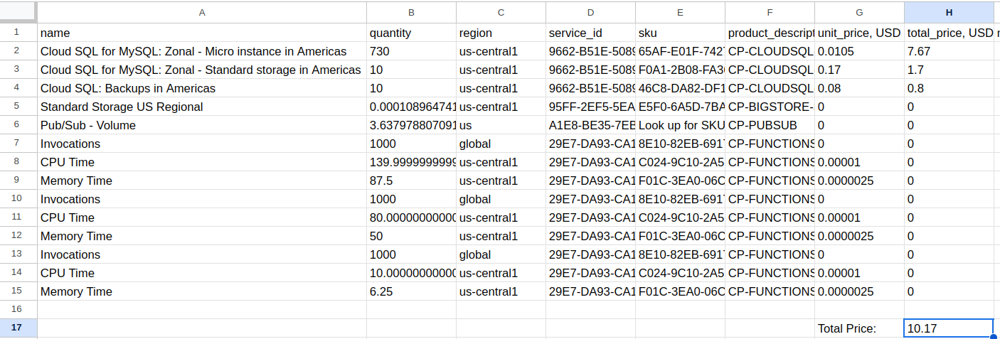
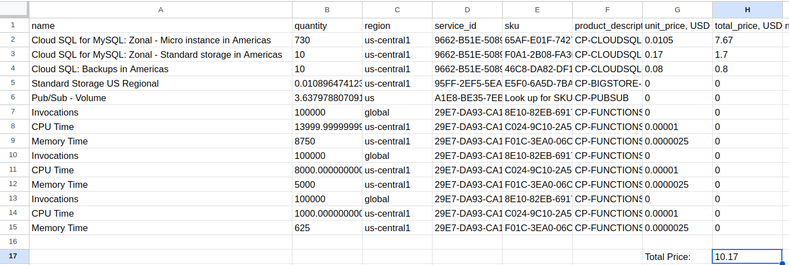
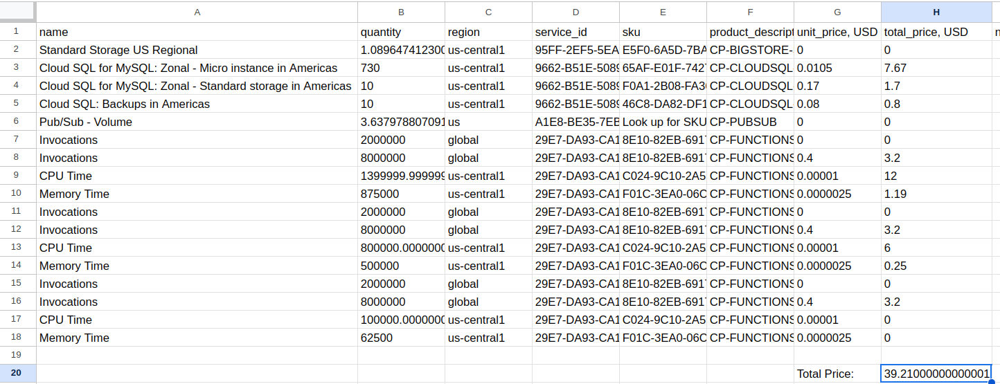
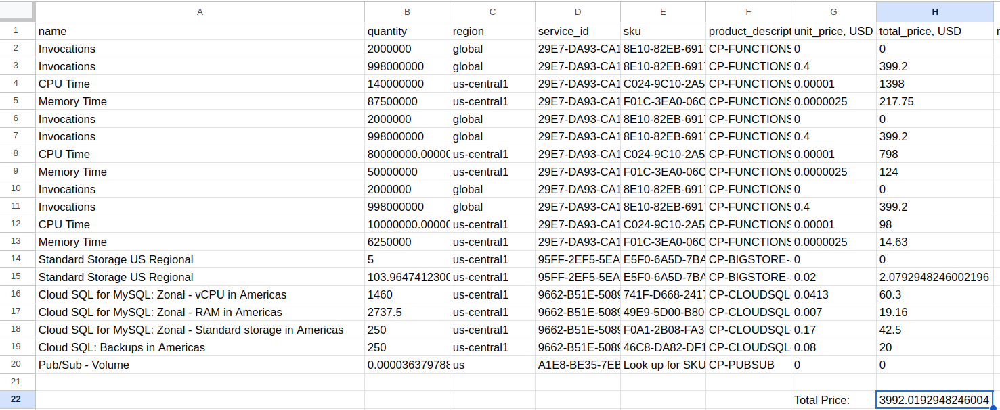
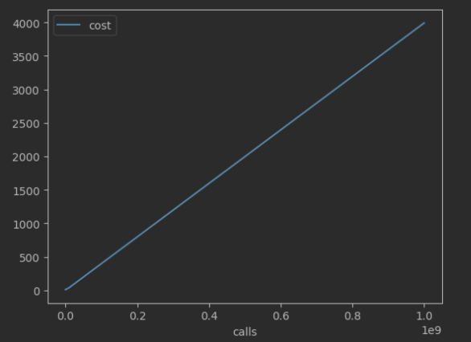

# 8. Pricing calculator

### Price for 1.000 HTTP function invocation

### Price for 100.000 HTTP function invocation

### Price for 10.000.000 HTTP function invocation

### Price for 1.000.000.000 HTTP function invocation

## Conclusion

As we can see, at a small number of function invocations 
the most expensive resource is SQL storage, other resources cost approximately 0.0$.
However, if the number of function invocations increases (more than ~1 mln) 
the most expensive resource becomes Cloud Functions. 
And it raises costs linearly, as you can see below:

Remarkably, the most expensive function is a function that stores events in Cloud SQL,
for instance, it took 2000$ for 1 billion events which is half of the total cost.
Next is a function that stores events in Cloud Storage,
for instance, it took 1320$ for 1 billion events which is a third of the total cost.

The main reason why these functions took as much cost it is their execution time, 
approximately 600-700ms.
So, to reduce the bill, we should optimize these functions to reduce their execution time.