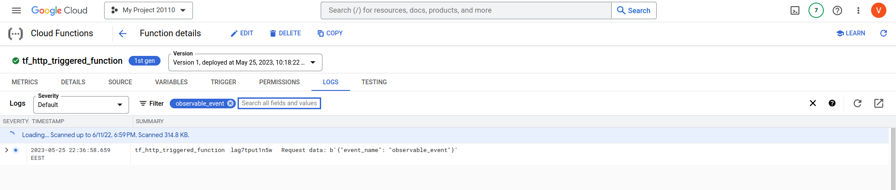
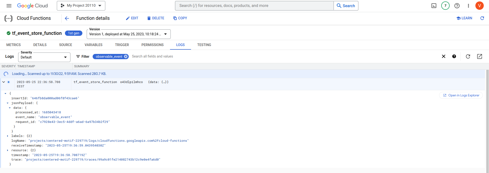
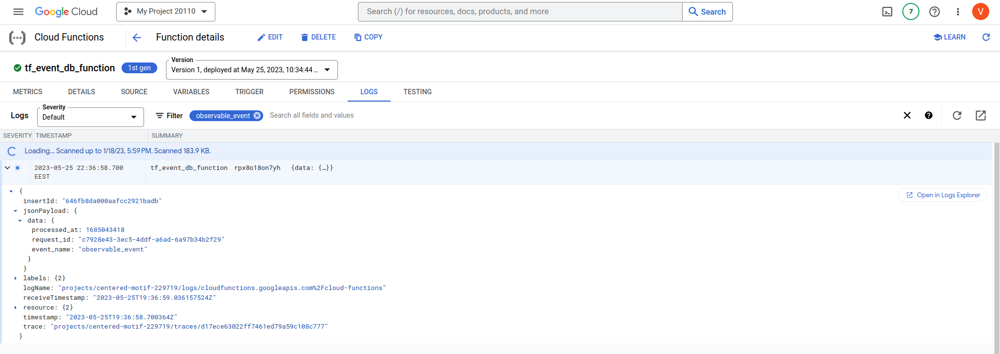
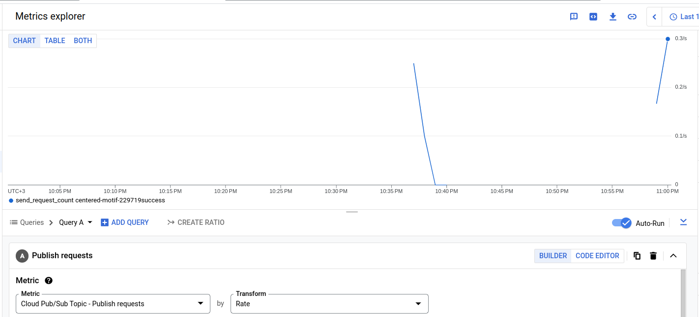
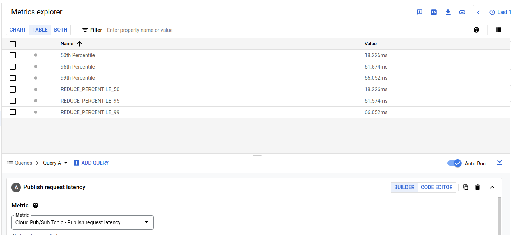
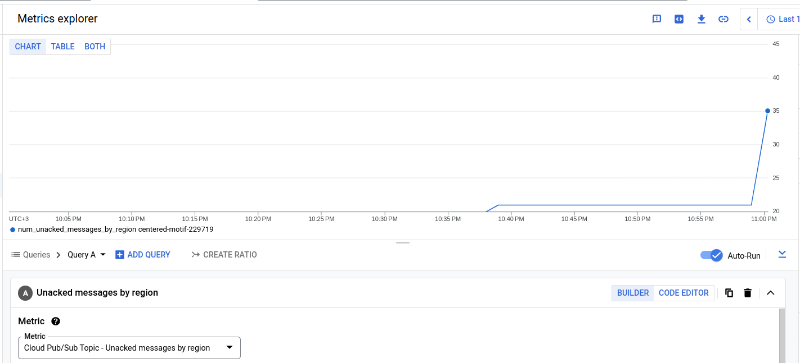
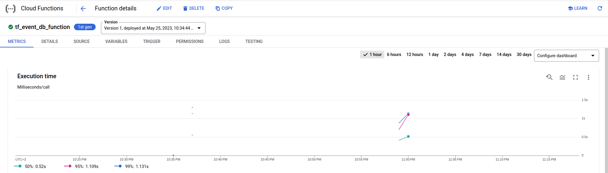
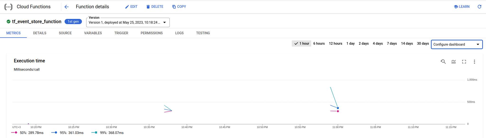

# 9. Observability: Logs, metrics, alerts

### 1. Find logs in each of three functions related to the same request

I sent the event with body: {"name": "observable_event"}.
There are Cloud functions logs with this event.

From HTTP triggered function:

---
From function that stores events in Cloud Storage:

---
From function that stores events in CLoud SQL:

---
### 2. Find built-in metrics that might help you to understand Event Stream performance

Firstly, I selected the metric *Publish requests* 
(cumulative count of publish requests, grouped by result)
to see how many requests come to this topic.

---
Next, I would like to see the metric *Publish request latency*
(distribution of publish request latencies in microseconds)
to understand publishing latency.

---
Finally, I chose the metric *Unacked messages by region*
(number of unacknowledged messages across all subscriptions and snapshots attached to a topic, broken down by Cloud region.)
to know how many messages stay unacknowledged.

---
### 3. Compare average execution time of functions that read from Event Stream

A function that stores events in database executes significantly longer,
compare to a function that stores events to blob storage.

Event to database function execution time:

---
Event to storage function execution time:

